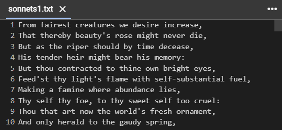
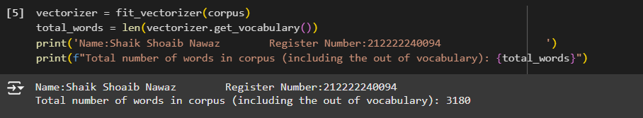
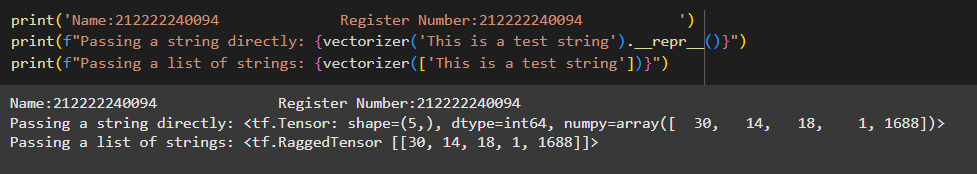
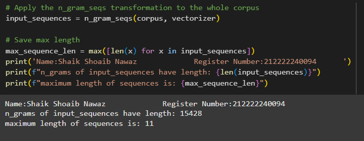
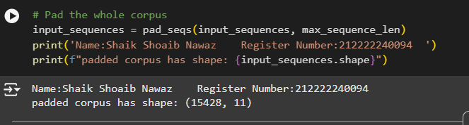
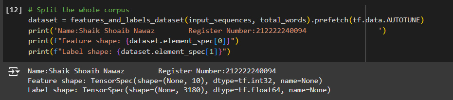
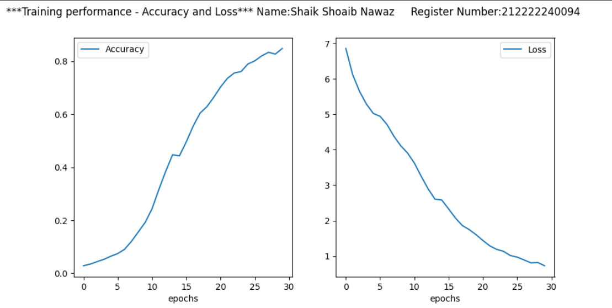
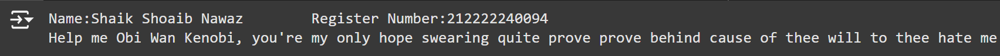

# Next-Word-Prediction-using-LSTM

## AIM

To develop an LSTM-based model for predicting the next word in a text corpus.

## Problem Statement and Dataset
The goal is to build a text generation model capable of generating coherent and contextually relevant text, given a starting prompt or seed text.
### Dataset

## DESIGN STEPS

### STEP 1:
The text data is preprocessed by tokenizing it into individual words, creating a vocabulary, and converting the text into numerical sequences. The sequences are then padded or truncated to a fixed length.

### STEP 2:
A recurrent neural network (RNN) model, specifically a bidirectional LSTM, is used to process the input sequences. The model learns to predict the next word in a sequence based on the previous words.

### STEP 3:
The model is trained on the preprocessed dataset using the categorical cross-entropy loss function and the Adam optimizer. Once trained, the model can generate text by taking a seed text as input and iteratively predicting the next word based on the current context.


## PROGRAM
### Name:Shaik Shoaib Nawaz
### Register Number:212222240094

### 1.fit_vectorizer function
```
def fit_vectorizer(corpus):
    """
    Instantiates the vectorizer class on the corpus

    Args:
        corpus (list): List with the sentences.

    Returns:
        (tf.keras.layers.TextVectorization): an instance of the TextVectorization class containing the word-index dictionary, adapted to the corpus sentences.
    """

    tf.keras.utils.set_random_seed(65) # Do not change this line or you may have different expected outputs throughout the assignment

    ### START CODE HERE ###

     # Define the object with appropriate parameters
    vectorizer = tf.keras.layers.TextVectorization(
        standardize='lower_and_strip_punctuation',  # Convert to lowercase and strip punctuation
        split='whitespace',  # Split on whitespace (default)
        ragged=True,  # Allow ragged tensors
        output_mode='int'  # Output as integers
    )

    # Adapt it to the corpus
    vectorizer.adapt(corpus)
    return vectorizer
```

### 2. n_grams_seqs function
```
# GRADED FUNCTION: n_gram_seqs

def n_gram_seqs(corpus, vectorizer):
    """
    Generates a list of n-gram sequences

    Args:
        corpus (list of string): lines of texts to generate n-grams for
        vectorizer (tf.keras.layers.TextVectorization): an instance of the TextVectorization class adapted in the corpus

    Returns:
        (list of tf.int64 tensors): the n-gram sequences for each line in the corpus
    """
    input_sequences = []

    ### START CODE HERE ###
    for sentence in corpus:
        # Vectorize the sentence to get the token indices
        vectorized_sentence = vectorizer(sentence)

        # Generate n-grams for the vectorized sentence
        for i in range(2, vectorized_sentence.shape[0] + 1):  # Start from 2 to avoid the first token
            n_gram = vectorized_sentence[:i]
            input_sequences.append(n_gram)

    ### END CODE HERE ###

    return input_sequences
```

### 3. pad_seqs function
```
# GRADED FUNCTION: pad_seqs

def pad_seqs(input_sequences, max_sequence_len):
    """
    Pads tokenized sequences to the same length

    Args:
        input_sequences (list of int): tokenized sequences to pad
        maxlen (int): maximum length of the token sequences

    Returns:
        (np.array of int32): tokenized sequences padded to the same length
    """

   ### START CODE HERE ###
    # Convert tensors to lists if necessary
    input_list = [seq if isinstance(seq, list) else seq.numpy().tolist() for seq in input_sequences]

    # Use pad_sequences to pad the sequences with left padding ('pre')
    padded_sequences = tf.keras.preprocessing.sequence.pad_sequences(
        input_list,              # Use the list of lists for padding
        maxlen=max_sequence_len,  # Set the maximum length
        padding='pre',            # Pad sequences to the left (before the sequence)
        dtype='int32'             # Specify the output type as int32
    )
    ### END CODE HERE ###

    return padded_sequences
```

### 4. features_and_labels_dataset function
```
# GRADED FUNCTION: features_and_labels

def features_and_labels_dataset(input_sequences, total_words):
    """
    Generates features and labels from n-grams and returns a tensorflow dataset

    Args:
        input_sequences (list of int): sequences to split features and labels from
        total_words (int): vocabulary size

    Returns:
        (tf.data.Dataset): Dataset with elements in the form (sentence, label)
    """
    ### START CODE HERE ###
    # Define the features by taking all tokens except the last one for each sequence
    features = [seq[:-1] for seq in input_sequences]

    # Define the labels by taking the last token for each sequence
    labels = [seq[-1] for seq in input_sequences]

    # One-hot encode the labels using total_words as the number of classes
    one_hot_labels = tf.keras.utils.to_categorical(labels, num_classes=total_words)

    # Build the dataset using the features and one-hot encoded labels
    dataset = tf.data.Dataset.from_tensor_slices((features, one_hot_labels))

    # Batch the dataset with a batch size of 16
    batch_size = 16  # Feel free to adjust this based on the global variable, but should be <= 64
    batched_dataset = dataset.batch(batch_size)

    ### END CODE HERE ###

    return batched_dataset
```

### 5.create_model function
```
# GRADED FUNCTION: create_model

def create_model(total_words, max_sequence_len):
    """
    Creates a text generator model

    Args:
        total_words (int): size of the vocabulary for the Embedding layer input
        max_sequence_len (int): length of the input sequences

    Returns:
       (tf.keras Model): the text generator model
    """
    model = tf.keras.Sequential()

   ### START CODE HERE ###
    # Input layer shape is max_sequence_len - 1 because we removed the last word as a label
    model.add(tf.keras.layers.Input(shape=(max_sequence_len - 1,)))

    # Embedding layer
    model.add(tf.keras.layers.Embedding(input_dim=total_words,
                                        output_dim=100,
                                        input_length=max_sequence_len - 1))

    # Add a Bidirectional LSTM layer with 150 units
    model.add(tf.keras.layers.Bidirectional(tf.keras.layers.LSTM(150)))

    # Add a Dense layer with 'total_words' units and softmax activation
    model.add(tf.keras.layers.Dense(total_words, activation='softmax'))

    # Compile the model
    model.compile(loss='categorical_crossentropy',
                  optimizer='adam',
                  metrics=['accuracy'])
    ### END CODE HERE ###

    return model
```

## OUTPUT
### 1. fit_vectorizer output



### 2. n_grams_seqs output


### 3. pad_seqs output


### 4. features_and_labels_dataset output


### 5. Training Loss, Validation Loss Vs Iteration Plot



### 6. Sample Text Prediction


## RESULT
Thus, the program to develop an LSTM-based model for predicting the next word in a text corpus is executed successfully.

